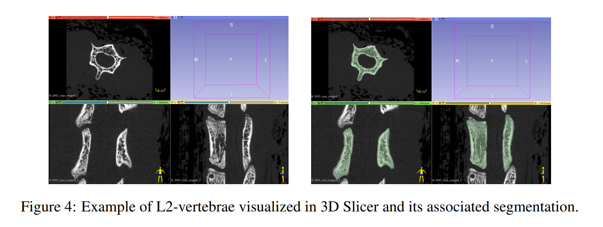
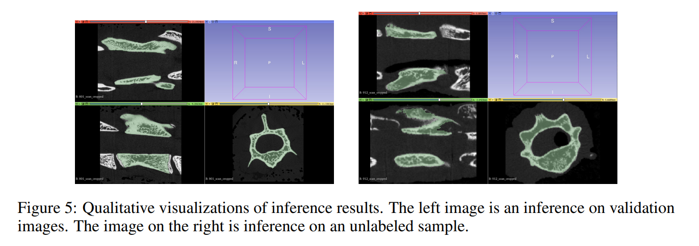

# Automated 3D Rat Vertebral Body Segmentation in μCT Images with Dilated Swin-UNETR and AUFRC Loss

This repository implements the proposed model in our [paper](vertebral-segmentation.pdf). As we still intend to further develop this project, updates might appear in the future.  

## Abstract
We present an advanced approach for murine vertebral segmentation, utilizing Swin-UNETR in combination with Asymmetric Unified Focal loss with ratio constraint (AUFRC) and dilated attention mechanisms. This optimized model improves the performance of semantic segmentation for trabecular bone within vertebrae in murine spines, providing a robust tool for cancer research. For an in-depth understanding of our implementation and a thorough quantitative and qualitative analysis of our work, please refer to the above-mentioned paper.

### Data Preprocessing and Augmentation
We focused on L2 vertebral region segmentation from µCT scans of rat spinal vertebral bones. The scans underwent a four-phase preprocessing: data extraction and format conversion, resampling and standardization, image resizing, and dataset validation. Image augmentation techniques were also applied.

### Model Architecture
Our model modifies Swin-UNETR by including a dilated attention mechanism and training with asymmetric unified focal loss. An overview of the Dilated Swin-UNETR architecture can be found [here](https://arxiv.org/abs/2201.01266).

### Demonstrations

For demonstration purposes, we include these figures from our paper.




## Getting Started

### Requirements
Dependencies include Python 3.8+, PyTorch 1.9+, torchvision 0.10+, NumPy 1.21+, SciPy 1.7+, SimpleITK 2.0+, Matplotlib 3.4+, Pandas 1.3+, and nibabel 3.2+.


## Prepare data

Get previous pretrained weights `model_swinvit.pt` from [here](https://github.com/Project-MONAI/research-contributions/tree/6ca48250bcffc455482caf8328d6c8b149145257/SwinUNETR/Pretrain). Store it in `pretrain/pretrained_models/model_swinvit.pt`

### Compute Canada

1. Add bender's ssh public key to CC
2. SSH into bender
3. Run the following command to copy source data for pretrain

```sh
# Where data reside on bender
LOCAL_DIR=/home/smsmt/datasets/Rat_mCT_v1/pre-processing/
# Where data reside on compute canada (CC), make sure this folder exist on CC
CC_DIR=/scratch/yuanshe5/vertebral-segmentation-rat-l2/pretrain/data/

scp -i ~/.ssh/bitbucket ${LOCAL_DIR}/*.nii yuanshe5@graham.computecanada.ca:${CC_DIR}
```

4. Run the following command to copy source data for finetune

```sh
# Where data reside on bender
LOCAL_DIR=/home/smsmt/datasets/Rat_mCT_train_v0
# Where data reside on compute canada (CC), make sure this folder exist on CC
CC_DIR=/scratch/c/cwhyne/yuanshe5/vertebral-segmentation-rat-l2/finetune/data/

scp -i ~/.ssh/bitbucket -r ${LOCAL_DIR}/. yuanshe5@niagara.scinet.utoronto.ca:${CC_DIR}
```

4. Run the following command to copy source data for finetune

```sh
# Where data reside on bender
LOCAL_DIR=/home/smsmt/datasets/Rat_mCT_v1
# Where data reside on compute canada (CC), make sure this folder exist on CC
CC_DIR=/scratch/c/cwhyne/yuanshe5/vertebral-segmentation-rat-l2/finetune/data/

scp -i ~/.ssh/bitbucket -r ${LOCAL_DIR}/* yuanshe5@niagara.scinet.utoronto.ca:${CC_DIR}
```

Then in CC, run the following to scale intensity between -1000 to 1000 and prepare dataset json

```sh
python data_preprocessing/intensity_scaling.py
python scripts/create_pretrain_dataset_json.py
```

### Bender

```sh
# Copy rat data into prtraining data folder
cp -r /home/smsmt/Rat_mCT_new/. ./pretrain/data/
# Ensure all images have same intensity range
python data_preprocessing/intensity_scaling.py
# Prepare rat data json
python scripts/create_pretrain_dataset_json.py
```

Modify `pretrain/utils/data_utils.py` to load the json and data from the right path.


## Pretrain

### Compute Canada

```sh
# Only needed for initial setup
source venv/bin/activate
python scripts/create_pretrain_dataset_json.py

# Run pretraining
sbatch run_pretrain.sh
# The output should comeback in `pretrain-{job_id}.out`
```

To check the state of your job, run `squeue | grep ${JOB_ID}`: `PD=pending`, `R=running`

### Bender

#### Training on top of previous pretrained weight
```
python pretrain.py --use_checkpoint --batch_size=1 --num_steps=100000 --lrdecay --eval_num=500 --logdir=0 --lr=6e-7 --use_ssl_pretrained

# Distributed version
python -m torch.distributed.launch --nproc_per_node=2 --master_port=11223 pretrain.py --batch_size=1 --num_steps=100000 --lrdecay --eval_num=500 --lr=6e-7 --decay=0.1 --use_ssl_pretrained
```

#### Resume training

```
python pretrain.py --use_checkpoint --batch_size=1 --num_steps=100000 --lrdecay --eval_num=500 --logdir=0 --lr=6e-6 --resume pretrain\pretrained_models\model_swinvit.pt
```

#### Pretrain from scratch

```
python pretrain.py --use_checkpoint --batch_size=1 --num_steps=100000 --lrdecay --eval_num=500 --logdir=0 --lr=6e-6 --roi_x=<Roi_x> --roi_y=<Roi_y> --roi_z=<Roi_z>
```

### Multi GPU Distributed Training

```bash
python -m torch.distributed.launch --nproc_per_node=<Num-GPUs> --master_port=11223 pretrain.py --batch_size=<Batch-Size> --num_steps=<Num-Steps> --lrdecay --eval_num=<Eval-Num> --logdir=<Exp-Num> --lr=<Lr>

# The config used in paper
python -m torch.distributed.launch --nproc_per_node=8 --master_port=11223 pretrain.py --batch_size=1 --num_steps=100000 --lrdecay --eval_num=500 --lr=6e-6 --decay=0.1
```

## Finetune

### Data preparation

```sh
python scripts/create_finetune_dataset_json.py
```

### Get pretrain model weights

If you skipped the pretrain steps above, you can still get our pretrain model weigths from [here](https://drive.google.com/drive/folders/1XYCtB7EQ-yRIg7s3nC9l1bqPng8yEIOZ?usp=share_link). Store the `.pt` files under foler `pretrain/pretrained_models`. Their corresponding training logs are in `pretrain-{jobid}.out`, the jobid associate with the model checkpoint suffix.

### Get final model weights

The final model weights after finetune can be obtained [here](https://drive.google.com/drive/folders/1XYCtB7EQ-yRIg7s3nC9l1bqPng8yEIOZ?usp=share_link). Their corresponding training logs are in `pretrain-{jobid}.out`. The experiment name is located in the output file and the experiment name should match the model folder.


### Run training

This trains the model and run different combination of parameter (stated below)
1. with / without pretrain
2. dice loss / AUFRC (our custom loss)
3. SwinUNETR / DilatedSwinUNETR (our custom architectural modification) 

```sh
sbatch run_finetune.sh --space_x=0.08 --space_y=0.08 --space_z=0.08 --use_dilated_swin --logdir="dilation_regloss_nopretrain_downsample" --optim_lr=1e-4 --regular_dice --use_ssl_pretrained=pretrain/pretrained_models/model_swinvit.pt
sbatch run_finetune.sh --space_x=0.08 --space_y=0.08 --space_z=0.08 --use_dilated_swin --logdir="dilation_regloss_pretrain_downsample" --optim_lr=1e-4 --regular_dice --use_ssl_pretrained=pretrain/pretrained_models/model_swinvit_dilation_370768.pt
sbatch run_finetune.sh --space_x=0.08 --space_y=0.08 --space_z=0.08 --use_dilated_swin --logdir="dilation_customloss_nopretrain_downsample" --optim_lr=1e-4 --use_ssl_pretrained=pretrain/pretrained_models/model_swinvit.pt
sbatch run_finetune.sh --space_x=0.08 --space_y=0.08 --space_z=0.08 --use_dilated_swin --logdir="dilation_customloss_pretrain_downsample" --optim_lr=1e-4 --use_ssl_pretrained=pretrain/pretrained_models/model_swinvit_dilation_370768.pt
sbatch run_finetune.sh --space_x=0.08 --space_y=0.08 --space_z=0.08 --logdir="nodilation_regloss_nopretrain_downsample" --optim_lr=1e-4 --regular_dice --use_ssl_pretrained=pretrain/pretrained_models/model_swinvit.pt
sbatch run_finetune.sh --space_x=0.08 --space_y=0.08 --space_z=0.08 --logdir="nodilation_regloss_pretrain_downsample" --optim_lr=1e-4 --regular_dice --use_ssl_pretrained=pretrain/pretrained_models/model_swinvit_no_dilation_370767.pt
sbatch run_finetune.sh --space_x=0.08 --space_y=0.08 --space_z=0.08 --logdir="nodilation_customloss_nopretrain_downsample" --optim_lr=1e-4 --use_ssl_pretrained=pretrain/pretrained_models/model_swinvit.pt
sbatch run_finetune.sh --space_x=0.08 --space_y=0.08 --space_z=0.08 --logdir="nodilation_customloss_pretrain_downsample" --optim_lr=1e-4 --use_ssl_pretrained=pretrain/pretrained_models/model_swinvit_no_dilation_370767.pt
```

### Run inference

This runs inference using the trained model from the 8 experiments above.

```sh
sbatch run_inference.sh --space_x=0.08 --space_y=0.08 --space_z=0.08 --use_dilated_swin --exp_name="dilation_regloss_nopretrain_downsample" --model=finetune/runs/dilation_regloss_nopretrain_downsample/model.pt
sbatch run_inference.sh --space_x=0.08 --space_y=0.08 --space_z=0.08 --use_dilated_swin --exp_name="dilation_regloss_pretrain_downsample" --model=finetune/runs/dilation_regloss_pretrain_downsample/model.pt
sbatch run_inference.sh --space_x=0.08 --space_y=0.08 --space_z=0.08 --use_dilated_swin --exp_name="dilation_customloss_nopretrain_downsample" --model=finetune/runs/dilation_customloss_nopretrain_downsample/model.pt
sbatch run_inference.sh --space_x=0.08 --space_y=0.08 --space_z=0.08 --use_dilated_swin --exp_name="dilation_customloss_pretrain_downsample" --model=finetune/runs/dilation_customloss_pretrain_downsample/model.pt
sbatch run_inference.sh --space_x=0.08 --space_y=0.08 --space_z=0.08 --exp_name="nodilation_regloss_nopretrain_downsample" --model=finetune/runs/nodilation_regloss_nopretrain_downsample/model.pt
sbatch run_inference.sh --space_x=0.08 --space_y=0.08 --space_z=0.08 --exp_name="nodilation_regloss_pretrain_downsample" --model=finetune/runs/nodilation_regloss_pretrain_downsample/model.pt
sbatch run_inference.sh --space_x=0.08 --space_y=0.08 --space_z=0.08 --exp_name="nodilation_customloss_nopretrain_downsample" --model=finetune/runs/nodilation_customloss_nopretrain_downsample/model.pt
sbatch run_inference.sh --space_x=0.08 --space_y=0.08 --space_z=0.08 --exp_name="nodilation_customloss_pretrain_downsample" --model=finetune/runs/nodilation_customloss_pretrain_downsample/model.pt
```

### Expected folder structure

Here is the snapshot of our directory structure for reference
```
.
├── data_preprocessing
│   ├── data_extracting_bender.py
│   ├── data_extracting_CIHR.py
│   ├── data_extracting_Fracture.py
│   ├── data_extracting_Osteosarcopenia.py
│   ├── data_preparation.py
│   ├── image_analysis
│   │   ├── amira_binary_processing.py
│   │   ├── amira_processing.py
│   │   ├── __init__.py
│   │   └── nifti_processing.py
│   ├── image_check.py
│   ├── image_sampling.py
│   └── intensity_scaling.py
├── finetune
│   ├── data
│   │   ├── labels
│   │   │   ├── 1021_segmentation.nii
│   │   └── scans
│   │       ├── 1021_scan_cropped.nii
│   ├── __init__.py
│   ├── jsons
│   │   └── dataset.json
│   ├── LICENSE
│   ├── optimizers
│   │   ├── __init__.py
│   │   └── lr_scheduler.py
│   ├── trainer.py
│   └── utils
│       ├── data_utils.py
│       ├── __init__.py
│       └── utils.py
├── finetune.py
├── inference.py
├── __init__.py
├── LICENSE
├── monai
│   ├── ...
├── pretrain
│   ├── data
│   │   └── frac_929_scan_cropped.nii
│   ├── data_scaled
│   │   └── frac_929_scan_cropped.nii
│   ├── __init__.py
│   ├── jsons
│   │   ├── dataset.json
│   │   └── __init__.py
│   ├── losses
│   │   ├── loss.py
│   ├── models
│   │   └── ssl_head.py
│   ├── optimizers
│   │   ├── __init__.py
│   │   ├── lr_scheduler.py
│   ├── pretrained_models
│   │   ├── model_swinvit_dilation_370768.pt
│   │   ├── model_swinvit_no_dilation_370767.pt
│   │   └── model_swinvit.pt
│   └── utils
│       ├── data_utils.py
│       ├── __init__.py
│       └── ops.py
├── pretrain.py
├── README.md
├── requirements-mist.txt
├── requirements.txt
├── requirements-win.txt
├── run_finetune_narval.sh
├── run_finetune.sh
├── run_inference.sh
├── run_preproc_narval.sh
├── run_preproc.sh
├── run_pretrain_dilated.sh
├── run_pretrain.sh
├── scripts
│   ├── create_finetune_dataset_json.py
│   ├── create_pretrain_dataset_json.py
│   └── load_synapse_data.py
```
### Useful links

1. https://docs.alliancecan.ca/wiki/PyTorch#PyTorch_with_Multiple_CPUs
2. https://docs.alliancecan.ca/wiki/Running_jobs#Memory
